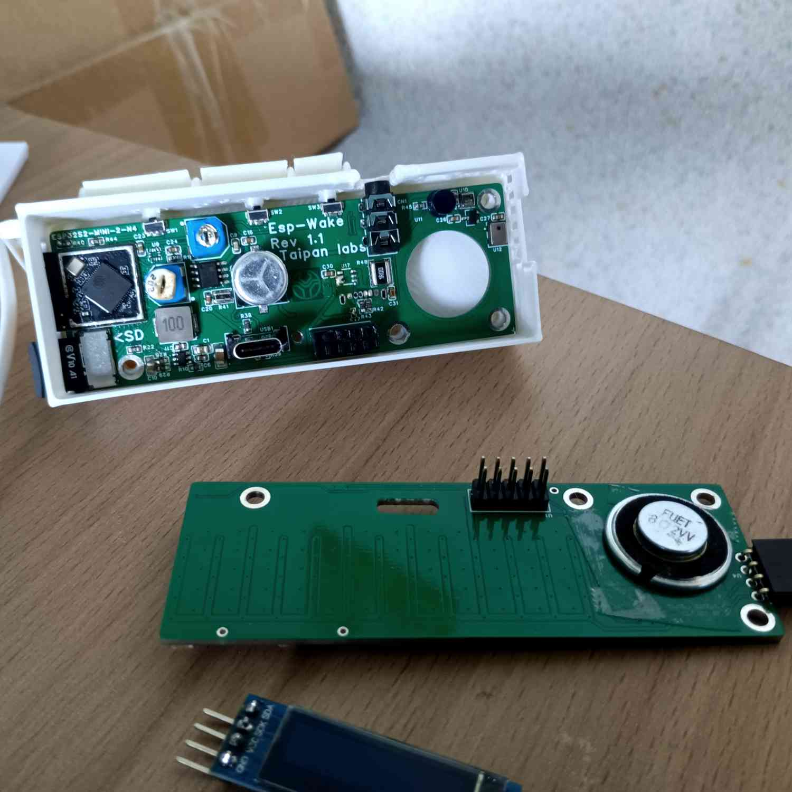
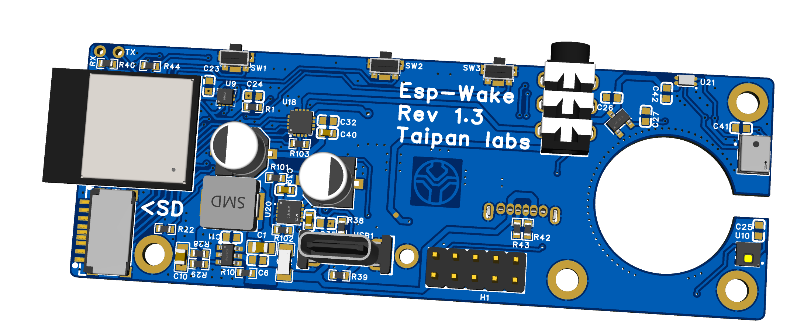

# esp_wake
Esp wake is an esp32S2 based alarm clock i made for myself using an esp32S2-mini2 module, various sensors and a modular frontend for displaying the time.   

The hardware is now open source and can be found in /hardware/ !

a few pictures:   

front view with optionnal side OLED:
<br/>


front cover off:<br/>


removed frontend (delided esp and the audio circuit is a bit toasty, that's only because of multiple reworks damaging it overtime):<br/>


(note that this circuit is the old one, this is the new working audio circuit that uses an I2S chip instead of the esp's terrible DAC):


don't forget that you'll need a small speaker that is not listed in the BOM! Also the pin header male/female have been reversed since V1.3 so watch out for that (visible in the latest backend render)


Also note that the schematics/pcb projects are provided as easyeda pro projects (.epro), and the 3d models are provided as a single .STEP file.

## compiling

You'll need to compile this by importing the entire root folder as a PlatformIO project. Note that even if you're supposed to be able to flash the esp32 S2 over usb, in practice you may need a usb<->uart adapter for the first bootloader flash as i've received some ESP32S2s that lacked said bootloader and wouldn't flash over usb.

~~lastly you need to create a source file:
`C:/cred/cred.h`
structured like :~~   
```cpp
#define WIFI_CREDENTIALS "SSID;password"
```
This is not needed anymore, the credentials are now on the micro sd card.

## Micro Sd card setup

You'll need a micro sd for this alarm clock to work, it'll contain wifi credentials, you music, as well as your programmed alarms. It can also be used to get a history of the sensors data if you choose to uncomment that feature in the main source file.  

You need to setup the micro sd like this:
```yaml
config/
    alarms.kcv <- this file must be created empty, it contains your alarms, see the chapter on this file for more info
    config.kcv <- reserved for later
    wifiCredentials.kcv <- contains your wifi credentials
logging/
    <- can be empty but must be created, the alarm clock shoudl create the files by itself for data logging
music/
    phoenix.wav <- for now the clock only supports a single alarm sound and it has to be .wav with this name in this folder!
```

### wifiCredentials.kcv
This is arguably the most important config file, it contains one wifi credential per line in this format:

```yaml
SSID1;PASS1
SSID2 with spaces supported;Pass2
... other cred combos for your various networks
```
it doesn't mind spaces since it splits based on line returns ('\n') and commas (';'), note that neither your SSID nor your password must contain extra ; that would break it.

### alarms.kcv
here is an example of the alarm format:
```cpp
15;7;0;0;1
16;7;0;0;1
17;7;0;0;1
18;7;15;0;1
19;6;45;0;1
```
here is the data it contains:   
`day_of_month(0->31)`;`hour(0->60)`;`minute(0->60)`;`second(0->60)`;`active(0/1)`

### the web interface
there is a simple web interface on this alarm clock that allows you to remotely edit `alarms.kcv`. It can be accessed by simply opening a web browser to the ip address of the alarm clock (which you can find in your router's web interface usually):   


The interface is pretty self-explanatory, you edit this as if you were editing alarms.kcv directly and click ok. Note that if you need to go back to the interface once you clicked ok you may need to open a new tab for that (small server side bug due to client caching).